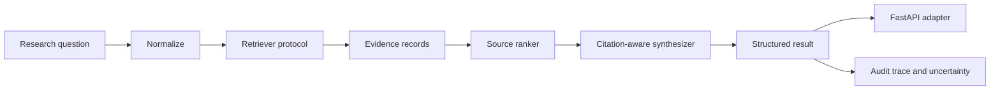

<div align="center">

# Aurelius Algorithm

### Evidence-first infrastructure for rigorous AI research

Aurelius is a modular research pipeline for turning questions into traceable, citation-aware outputs. It separates retrieval, source evaluation, synthesis, and delivery so every conclusion can be inspected, tested, and improved.

[](https://www.python.org/)
[](https://fastapi.tiangolo.com/)
[](LICENSE)
[](#roadmap)

</div>

## Overview

Aurelius Algorithm is the core research and reasoning layer for the Aurelius AI model. The project is designed around a simple premise: useful AI research should be **evidence-first, explicit about uncertainty, and reproducible from its inputs**.

The current implementation provides a deterministic foundation with a clean seam for live search, vector indexes, databases, and model-backed synthesis. It does not make network claims or invent answers when supporting evidence is unavailable.

## Features

- **Structured research requests** with normalized questions and stable query terms.
- **Pluggable retrieval** through a small `Retriever` protocol.
- **Transparent source ranking** using relevance, credibility, and recency signals.
- **Citation-aware synthesis** that preserves the relationship between excerpts and source URLs.
- **Confidence and uncertainty signals** including open questions and missing-evidence states.
- **Audit traces** that record pipeline stages and candidate counts.
- **Modular FastAPI layer** with Pydantic validation and dependency injection.
- **Deterministic tests** that make the core behavior safe to extend.

## Architecture



The domain pipeline is intentionally independent from HTTP and external providers:

| Layer | Responsibility | Replaceable boundary |
| --- | --- | --- |
| `ResearchQuestion` | Normalize input and derive query terms | Input adapters |
| `Retriever` | Return candidate `EvidenceRecord` objects | Search API, vector store, database |
| `SourceRanker` | Score relevance, credibility, and recency | Domain-specific ranking strategy |
| `CitationAwareSynthesizer` | Produce conservative, cited output | Model-backed synthesis with faithfulness checks |
| `AureliusAlgorithm` | Orchestrate the pipeline and expose the trace | Application services |
| `src/api.py` | Validate and serve the domain result over HTTP | Web, CLI, or event-driven adapters |

The default ranking weights are explicit and documented: **55% relevance, 30% credibility, and 15% recency**. These are a baseline for experimentation, not a claim of universal optimality.

## Quick Start

### Install

Python 3.10 or newer is recommended.

```bash
git clone https://github.com/castro901-art/aurelius-algorithm.git
cd aurelius-algorithm
python -m venv .venv
source .venv/bin/activate  # Windows: .venv\\Scripts\\activate
pip install fastapi uvicorn pytest
```

### Run the test suite

```bash
python -m pytest
```

### Start the API

```bash
uvicorn src.api:app --reload
```

Once running:

- Health check: `GET http://127.0.0.1:8000/health`
- Research endpoint: `POST http://127.0.0.1:8000/research`
- Interactive OpenAPI docs: `http://127.0.0.1:8000/docs`
- ReDoc: `http://127.0.0.1:8000/redoc`

Example request:

```bash
curl -X POST http://127.0.0.1:8000/research \\
  -H "Content-Type: application/json" \\
  -d '{"question":"How does retrieval improve research quality?"}'
```

The default API is intentionally configured with an empty `InMemoryRetriever`. Without injected evidence, it returns `status="needs_sources"` and `confidence=0.0` rather than presenting an unsupported answer as fact.

## Use the core pipeline

```python
from src.algorithm import AureliusAlgorithm, EvidenceRecord, InMemoryRetriever

records = [
    EvidenceRecord(
        id="paper-1",
        title="Evidence-first research",
        url="https://example.com/paper-1",
        excerpt="Traceable evidence makes research outputs easier to audit.",
        source_type="paper",
        credibility=0.9,
    )
]

model = AureliusAlgorithm(retriever=InMemoryRetriever(records))
result = model.research("How does evidence improve research outputs?")

print(result.answer)
print(result.citations)
print(result.trace)
```

## Extend with a live retriever

The API and algorithm depend on the `Retriever` protocol, not on `InMemoryRetriever`. Implement `search(question)` in a live search, vector, or database adapter that returns `EvidenceRecord` objects, then inject it through the application factory:

```python
from src.api import create_app

live_retriever = build_live_retriever()
app = create_app(retriever=live_retriever)
```

This keeps source integration separate from ranking, synthesis, validation, and HTTP concerns. The endpoint contract remains stable as retrieval evolves.

## Project layout

```text
.
├── src/
│   ├── __init__.py
│   ├── algorithm.py       # Research pipeline and public interfaces
│   └── api.py             # FastAPI adapter and Pydantic contracts
├── docs/
│   ├── architecture.md    # Detailed design and extension points
│   ├── social-preview.svg  # Repository branding asset and preview placeholder
│   └── .gitkeep
├── tests/
│   ├── test_algorithm.py  # Core pipeline tests
│   ├── test_api.py         # HTTP contract tests
│   └── .gitkeep
├── .gitignore
├── LICENSE
└── README.md
```

## Research principles

1. **Evidence before confidence:** conclusions should be grounded in traceable sources.
2. **Explicit uncertainty:** incomplete, conflicting, or low-quality evidence should be visible.
3. **Modular design:** retrieval, ranking, synthesis, presentation, and transport should remain independently testable.
4. **Reproducibility:** important outputs should be explainable from inputs, configuration, and source records.
5. **Responsible research:** the system should distinguish facts, interpretations, and open questions.

## Roadmap

### Foundation

- [x] Deterministic evidence records and research result schema
- [x] Pluggable retriever protocol and in-memory reference implementation
- [x] Transparent source ranking and citation-aware synthesis
- [x] FastAPI adapter with health and research endpoints
- [x] Automated tests for core and API contracts

### Near term

- [ ] Trusted retrieval adapters for web, local corpora, and vector indexes
- [ ] Source deduplication and canonical URL handling
- [ ] Contradiction detection across evidence records
- [ ] Evaluation fixtures for retrieval recall, citation precision, and answer faithfulness
- [ ] Structured configuration and observability for production deployments

### Long term

- [ ] Model-backed synthesis with citation-preservation and faithfulness checks
- [ ] Research-task planning and multi-hop evidence collection
- [ ] Benchmarking across domains, languages, and source types
- [ ] Threat model, limitations, and responsible-use documentation

## Status

Aurelius is in early development. The current release is a stable, dependency-light foundation for experimentation and integration work. Interfaces may evolve as retrieval and evaluation requirements become clearer.

## Contributing

Contributions are welcome. Open an issue before substantial changes so the proposed direction can be discussed. New functionality should include focused tests and documentation, and changes to public interfaces should explain migration impact.

## License

Aurelius Algorithm is released under the [MIT License](LICENSE).
